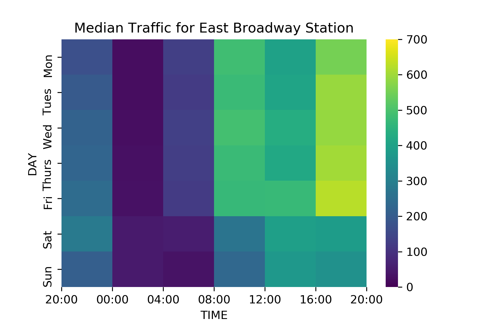
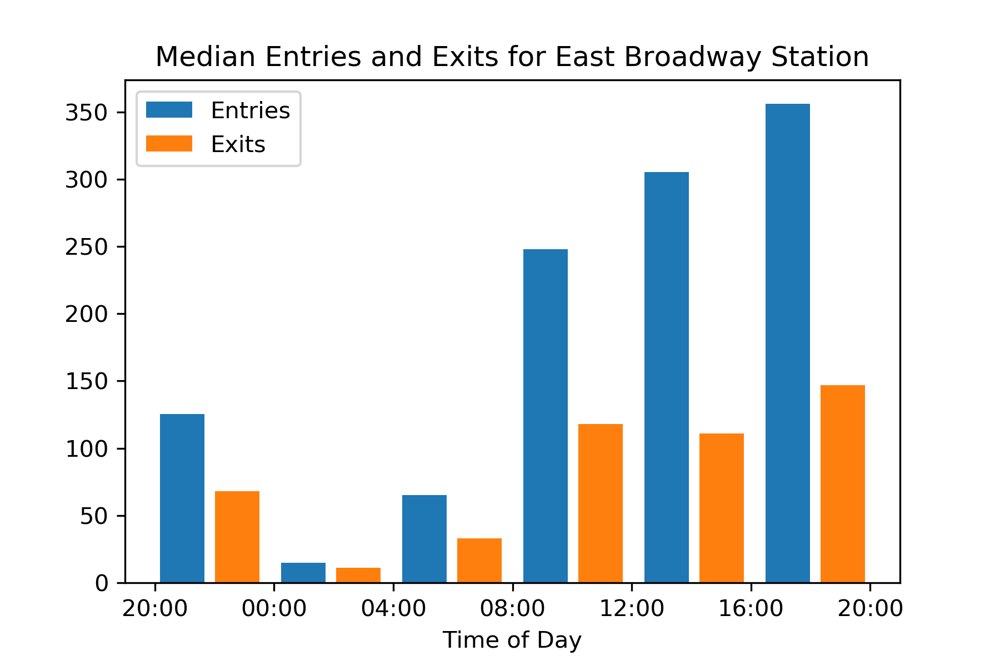
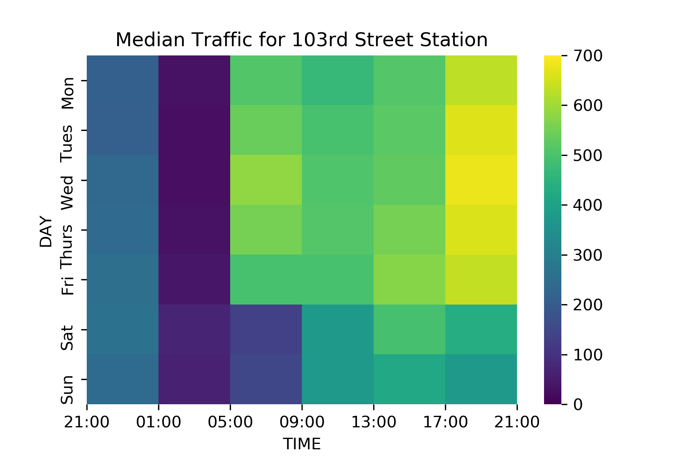
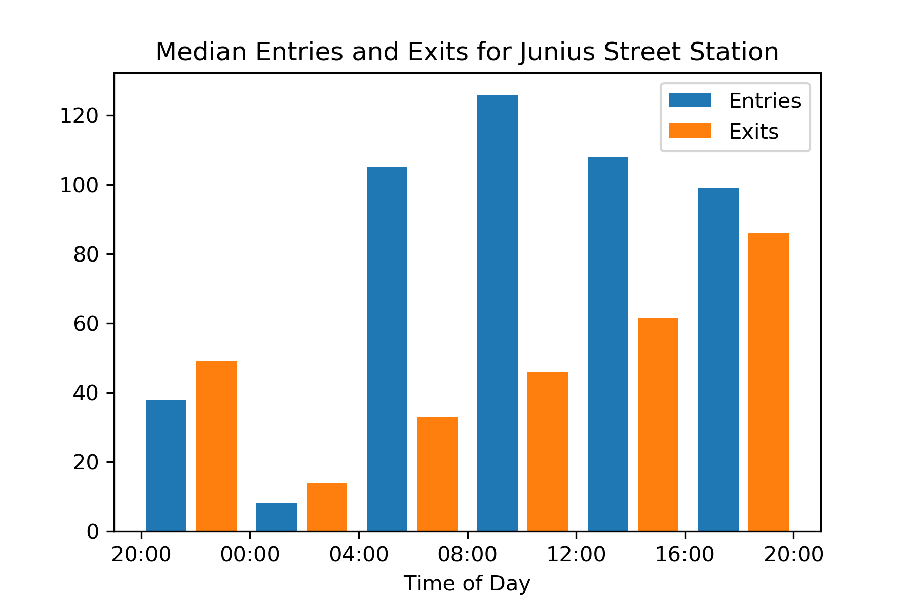

# data
This directory contains both raw data sources and outputs.

## Contents
### Data Sources
* *nyc_census_tracts.csv*\
    Taken from Kaggle.com() original data source is the american communities survey of 2015
* *census_block_loc.csv*\
    Taken from Kaggle.com() original data source is the american communities survey of 2015
* *stations.csv*\
    Taken from mta website
### Outputs
* *stations_with_tract_id.csv*
    see [mta_station_data.py](../scripts/readme.md#2-mta_station_datapy)
* *census_tracts.pkl/ census_tracts_small.pkl*
    see [mta_station_data.py](../scripts/readme.md#2-mta_station_datapy)
    census_tracts.pkl is 100 x 100 px
    census_tracts_small.pxl is 10 x 10 px 
* *plots*

heatmap_poverty.svg                  | heatmap_poverty_pop.svg 
:-----------------------------------:|:-----------------------------------:
 | 

Heatmaps                              |  barcharts
:------------------------------------:|:--------------------------------------------:
 | 
:------------------------------------:|:--------------------------------------------:
 | 
:------------------------------------:|:--------------------------------------------:
 | 
:------------------------------------:|:--------------------------------------------:
 | 
