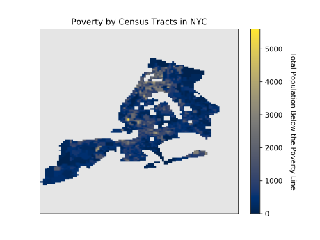

# Scrips
## Description of Files
1. *fcc_api_interface.py*\
this scripts manages the get request to the FCC api that maps latitude and longitude coordinates to census block ids.

2. *mta_station_data.py*\
this script uses the *fcc_api_interface.py* to get census block ids and census tract ids for each mta stations

3. *poverty_plotting.py*\
handles generating heat maps of poverty data (poverty rate and total population below the poverty line) for all census 
blocks in NYC. This is achieved through creating an array of the span of the extrema in latitude and longitude for the 
census tracts in NYC.  Each id is then polled to the FCC api to get census tract ids then the corresponding poverty 
data is mapped to the array and plotted.

## Outputs

1. stations_with_tract_id.csv

2. Plots:

Map of poverty rate                          | Map of Total Population in Poverty
:-------------------------------------------:|:-----------------------------------:
 | 
